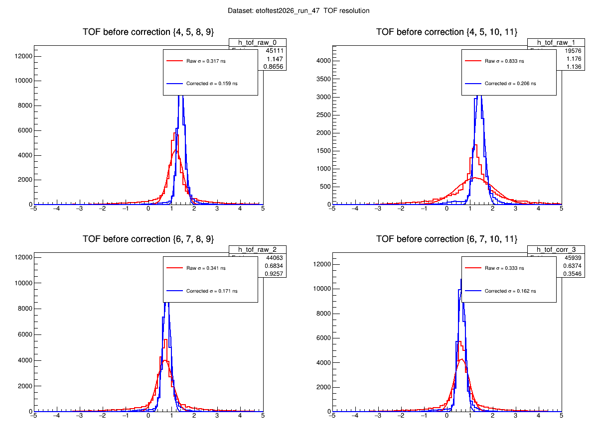
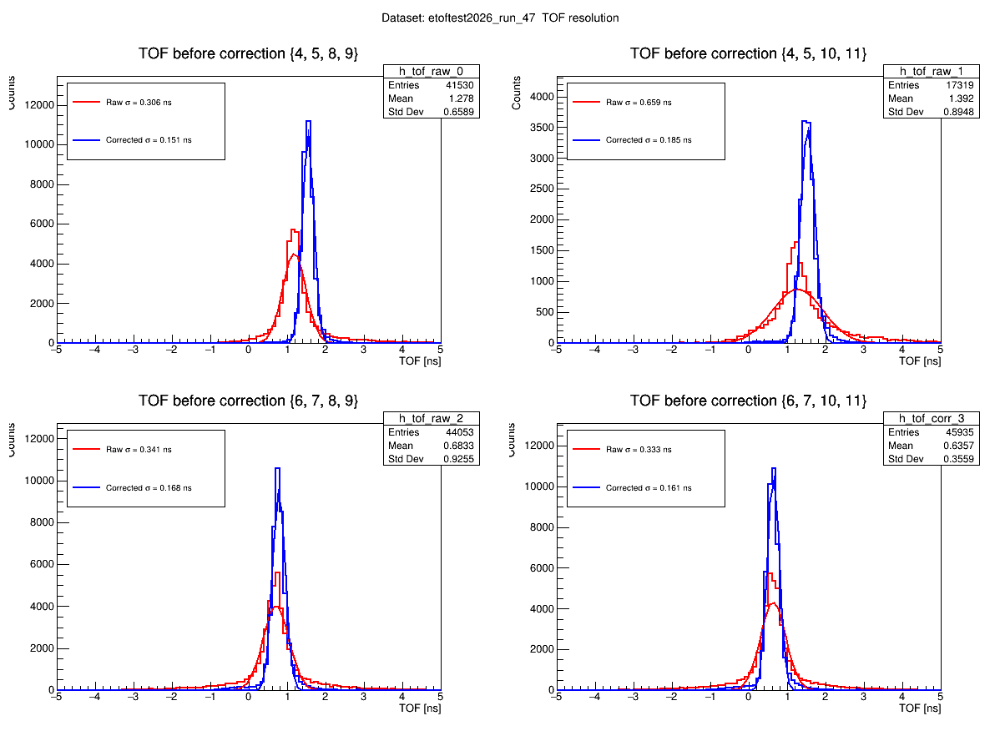
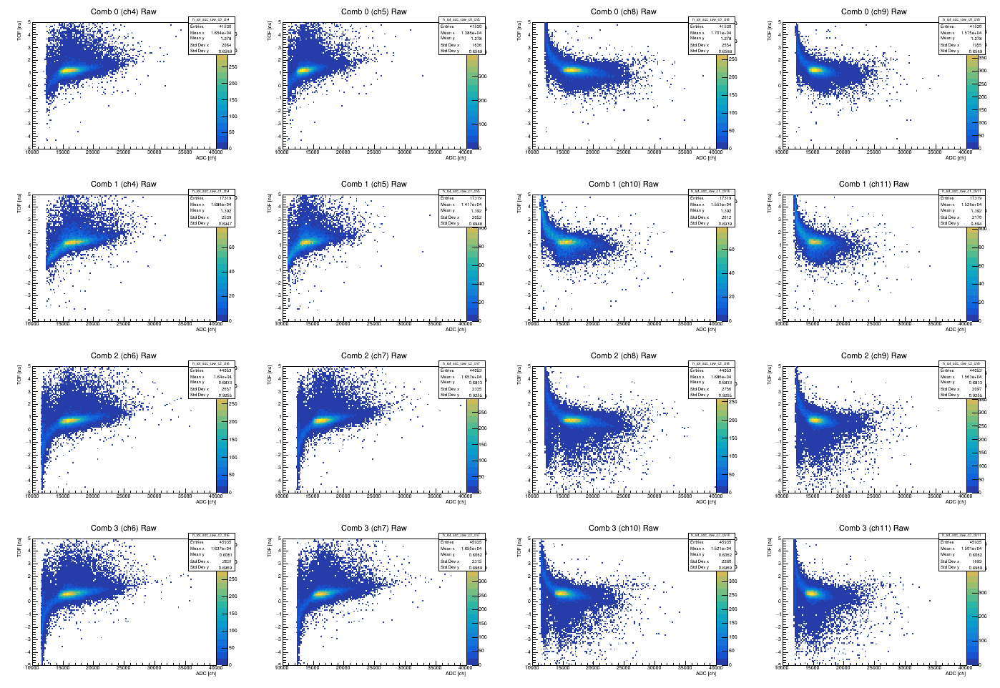
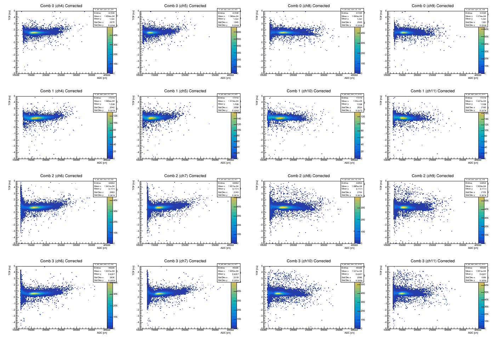

# 実験名: EngeTOF

- 担当: 岡林
- 目的: EngePiTOFの時間幅をPHcorrectionで補正し、そこから各シンチの時間分解能を出す

# 26/06/27
## 1. 前提・条件
- calib2.ccを元に再設計、簡素化して、以下のようなことができるようにした(calib4.cc)
  - PiTOF8本を対象に、PHcorrectionのパラメータを与える
    - $TDC_{corrected} = TDC_{raw} + ({c_1}/{\sqrt{ADC}} + c_2/ADC)$
  - TMinuitで4通りのTOFの時間幅の和を最小化し、16パラメータを最適化
    - ${\chi}^2 = \sum\limits_{i=1}^4 (TOF_i - \overline{TOF_i})^2$
- ここからは自分で計算する      
  - TOFをプロットして時間幅が得られるので、以下の式からシンチごとの時間分解能を出す
    - $\sigma_{TOF_{1X4-2X4}}^2 = \sigma_{1X4}^2 + \sigma_{2X4}^2$
    - $\sigma_{TOF_{1X4-2X5}}^2 = \sigma_{1X4}^2 + \sigma_{2X5}^2$
    - $\sigma_{TOF_{1X5-2X4}}^2 = \sigma_{1X5}^2 + \sigma_{2X4}^2$
    - $\sigma_{TOF_{1X5-2X5}}^2 = \sigma_{1X5}^2 + \sigma_{2X5}^2$
- PiTOFの4組だけだと連立して解けないことに気づく。一旦解析を進める。

- データ:/data/Users/okabayashi/mine/etoftest2026_run_47.root

## 2. 実行コマンド
- 解析コード:/data/Users/okabayashi/mine/calib4.cc
- cut条件: adc - ped > 0, -100 < tdc_raw < 0
  - pedは各chのadcヒストグラムでのペデスタルピークの中心のadcとした。
    
## 3. 結果
- 以下のようなTOF時間幅が得られた。
  - $\sigma_{TOF_{1X4-2X4}} = 162ps$
  - $\sigma_{TOF_{1X4-2X5}} = 171ps$
  - $\sigma_{TOF_{1X5-2X4}} = 206ps$
  - $\sigma_{TOF_{1X5-2X5}} = 159ps$
- 整合性が取れていないことがわかる。
  - $\sigma_{1X5}^2 - \sigma_{1X4}^2 = 206^2 - 162^2 \neq 159^2 - 171^2$

*図1. TOF時間幅（横軸はns）*

*図2. 補正によるadc-tdc分布の変化*

## 4. 考察
- 1X5-2X4:{4,5,10,11}の組み合わせだけ元の分解能が悪すぎたりデータ数が半分以下しかなかったりと怪しい。ここが160psくらいまで抑えられれば上の話も辻褄が合うのでは。cut条件が甘い？
- 例えば「1X（上段）と2X（下段）それぞれで分解が一緒」という仮定をしたとしても（ $\sigma_{1X5}^2 - \sigma_{1X4}^2 \simeq 0$ で検証できる）、上の4つの式だけでは1Xと2Xそれぞれの分解能は導出できない。
- 2本のETOF（E1,E2）を導入すると連立式は解けるわけでもない、、、？
  
## 5. 次アクション
- 具体的には未定。どうやって各層の分解能を出したのか、お聞きする。
- cut条件の工夫は考えたい。
- 整合性とか考えず、今4通りでやってるけどこれら全部を同じヒストにプロットして幅を出すのでも良いんじゃないか（めちゃくちゃ雑にはなる）とも考えた。
- 両側読み出しの時間差を考えることでの位置依存性、つまり飛来角度依存性を考慮することもできそう。

# 26/06/30
## 1. 変更
- calib4.ccを元に再設計して、以下のようなことができるようにした(calib5.cc powered by Gemini)
  - ADC-TDC分布(16個)をADC-TOF分布(32個)に変更 
  - ADCのcut条件として、ペデスタルの中心だったのを右端に変更
  - 軸ラベルや凡例などレイアウト変更

## 2. 実行コマンド
- 解析コード:/data/Users/okabayashi/mine/calib4.cc
- データ:/data/Users/okabayashi/mine/etoftest2026_run_47.root
- cut条件: adc - ped > (pedの右端), -50 < tdc_raw < 0
  - pedは各chのadcヒストグラムでのペデスタルピークの中心adc
    
## 3. 結果
- 以下のようなTOF時間幅が得られた。
  - $\sigma_{TOF_{1X4-2X4}} = 161ps$
  - $\sigma_{TOF_{1X4-2X5}} = 168ps$
  - $\sigma_{TOF_{1X5-2X4}} = 185ps$
  - $\sigma_{TOF_{1X5-2X5}} = 151ps$

*図1. TOF時間幅（横軸はns）*

*図2. 補正によるadc-tof分布の変化*

## 4. 考察
- 補正後でも若干のテールの広がり、2ピークあるように感じる
  -  Gussianのfitをみるとテールの影響は受けてなさそうだから分解能の値に対しては問題はないけどもね、、、
  -  cut条件を見直さないとね
- 結局各シンチの分解能はどう出すの？
  - ETOFをまぜると？
- 関数を$`\frac{c_1}{(ADC - C_2)^{C_3}}`$にしてfittingしてみる
- adcの0なるデータ多くね？
- tdcピークが分かれてる理由

