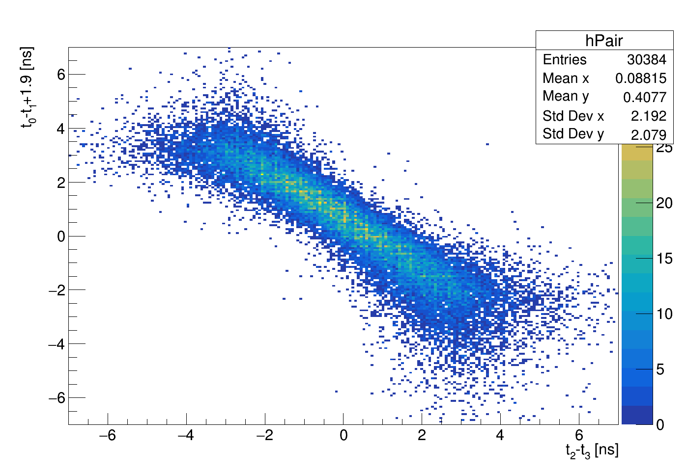

# 実験名: EngeTOF

# 26/07/06, 10: 時間分解能解析
## 1. 前提、条件、変更
- ETOFを含めればE1,E2,1X4,1X5,2X4,2X5それぞれ導出する文の式が足りることに気づく
  - 13通り（1X4-1X5と2X4-2X5を除いている ）の組み合わせに対し、計算
  - 手計算じゃなくて、SVDによってもっともらしい分解能を求める
 
- fit関数は今は何でも良いので t_corr = t – (c1/√a + c2/a) 。(TOF – ave(TOF))^2 の和を最小化

- 【NEW】Cut条件を変えた
    - ETOFの中心を垂直に通ったようなイベントを抽出（図のうち、両方の軸で-1~1の間の領域のデータのみを抽出）
      



## 2. 実行
- 解析コード:/data/Users/okabayashi/mine/ calib10.ccおよびcalib8.cc 　
- データ:/data/Users/okabayashi/mine/etoftest2026_run_47.root (47-50の4つのrun)
- 共通のcut条件: adc - ped > (pedの右端), -50 < tdc_raw < 0
  - pedは各chのadcヒストグラムでのペデスタルピークの中心adc
    
## 3. 結果
- 以下のような分解能が得られた。
  - いずれのrunにおいても分解能の改善が見られる。
  - 1X4と1X5の分解能の逆転は何なんだ

*run47*

| Detector | σ [ps] w/ new cut | σ [ps] w/ no cut | 
|:--------|------:|------:|
| E1  | 185.820189 | 251.683221 |
| E2  | 143.170317 | 233.165602 | 
| 1X5 | 105.635790 | 82.477068 |
| 1X4 | 76.744931 | 122.513711 |
| 2X5 | 146.631628 | 184.064217 |
| 2X4 | 125.813757 | 182.197630 |

*run48*

| Detector | σ [ps] w/ new cut | σ [ps] w/ no cut | 
|:--------|------:|------:|
| E1  | 179.633418  | 245.847730 |
| E2  | 145.179345 | 233.798387   | 
| 1X5 | 124.011762 | 82.905226  |
| 1X4 | 77.820602 | 132.410071 |
| 2X5 | 157.362012 | 176.231236 |
| 2X4 | 127.317642 | 185.170117 |

*run49*

| Detector | σ [ps] w/ new cut | σ [ps] w/ no cut | 
|:--------|------:|------:|
| E1  | 182.585495 | 250.858666 |
| E2  | 147.870391 | 231.093458 | 
| 1X5 | 108.176298 | 91.770494 |
| 1X4 | 80.601590 | 124.803876 |
| 2X5 | 143.536790 | 180.321924 |
| 2X4 | 129.844337 | 188.348100 |

*run50*

| Detector | σ [ps] w/ new cut | σ [ps] w/ no cut | 
|:--------|------:|------:|
| E1  | 168.151051  | 221.441714 |
| E2  | 135.378967 | 202.150335 | 
| 1X5 | 113.780990 | 127.517591 |
| 1X4 | 82.057301 | 136.193918  |
| 2X5 | 147.059726 | 162.813379 |
| 2X4 | 120.969042 | 172.908877 |

## 4. 考察


# 26/07/14: シミュレーション
## 1. 目的
- 夏学やSNPポスター発表にむけてアブストを書く -> 寿命測定の要求分解能っていくつなんだ？ -> 西さんslideによるとEngeTOFの要求分解能はおよそ100ps、らしい
- シミュレーションしてみよう

## 2. 実行
- 疑似データセットの用意
  - 崩壊はexp、hksとengeそれぞれが時間分解能を持つ
- Gaussian * Exp の畳み込みでfitting -> 推定寿命およびその統計誤差を求める
- このシミュレーションを様々な $'\sigma_{enge}'$ の値に対してたくさん（100,000回）行う -> 中心極限定理よりそれぞれの $'\sigma_{enge}'$ に対して得られる100,000個の推定寿命の分布は真値を中心としたガウシアンになる。 -> こいつの幅ができるだけ狭ければ良い。

## 3. 結果
パラメーターはこんな感じ。

 ```
# --- 1. パラメータ ---
tau_true = 300.0       # 真の寿命 [ps]
sigma_hks = 60.0       # HKSの時間分解能 [ps]
N_events = 1000        # 取得予定のイベント数
offset = 0.0           # ガウシアンの時間オフセット [ps]
N_roop = 100000        # ループ回数

list_sigma_enge = np.arange(0, 301, 10)  # Engeの時間分解能 [ps]のリスト
```

出力結果はこんな感じ。


